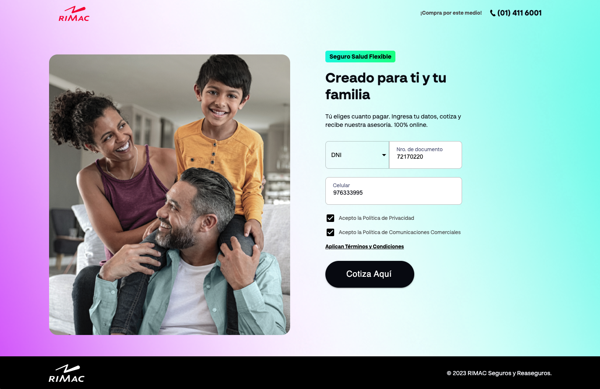

# RIMAC CHALLENGE

Este proyecto es una aplicación web construida con React y TypeScript, utilizando una arquitectura basada en características (feature-based structure). A continuación se describe el propósito de las librerías utilizadas y la estructura del proyecto.

[Visita la aplicación desplegada en Amplify](https://rimac-challenge.asynclogic.net/)

Puedes poner cualquier dato en el formulario (ya tiene validaciones según el campo) y el sistema consumirá el servicio de https://rimac-front-end-challenge.netlify.app/api/user.json 

Ejemplo (puede ser cualquier dato):



## 🛠️ Tecnologías y Librerías Utilizadas

### Dependencias principales:
1. **[@emotion/react y @emotion/styled](https://emotion.sh/docs/introduction)**
   - **Por qué:** Se utilizó para manejar estilos dinámicos y personalizados en el proyecto. Su integración con Material-UI facilita la personalización de componentes.
   - **Uso:** Crear estilos consistentes con facilidad y flexibilidad.

2. **[@mui/material y @mui/icons-material](https://mui.com/)**
   - **Por qué:** Proporcionan componentes visuales preconstruidos, fáciles de usar y con una buena experiencia de usuario (UX).
   - **Uso:** Diseño responsivo y componentes como botones, formularios, y menús.

3. **[axios](https://axios-http.com/)**
   - **Por qué:** Simplifica las peticiones HTTP con una API limpia y manejo robusto de errores.
   - **Uso:** Conexión con APIs para cargar y enviar datos.

4. **[react-hook-form](https://react-hook-form.com/)**
   - **Por qué:** Para manejar formularios de manera eficiente, minimizando re-renderizados.
   - **Uso:** Validación de formularios con ayuda de `yup` para las reglas.

5. **[yup](https://github.com/jquense/yup)**
   - **Por qué:** Permite la validación de datos mediante esquemas.
   - **Uso:** Validación de campos en formularios junto con `react-hook-form`.

6. **[zustand](https://zustand-demo.pmnd.rs/)**
   - **Por qué:** Un estado global simple y ligero, ideal para manejar datos compartidos.
   - **Uso:** Almacén de datos compartidos entre componentes.

7. **[sass](https://sass-lang.com/)**
   - **Por qué:** Extiende CSS con funciones como variables, anidación y mixins.
   - **Uso:** Estilización de los componentes usando la metodología BEM para un código escalable y organizado.

8. **[react-router-dom](https://reactrouter.com/)**
   - **Por qué:** Manejo de rutas dinámicas y navegación entre vistas.
   - **Uso:** Creación de un sistema de rutas para las diferentes páginas del proyecto.

9. **[date-fns](https://date-fns.org/)**
   - **Por qué:** Proporciona utilidades para manejar fechas de forma sencilla.
   - **Uso:** Manipular fechas en el proyecto (para calcular la edad del usuario).

### Dependencias de desarrollo:
1. **[typescript](https://www.typescriptlang.org/)**
   - **Por qué:** Mejora la calidad del código mediante tipado estático.
   - **Uso:** Garantizar un desarrollo más robusto y predecible.

2. **[@vitejs/plugin-react y vite](https://vitejs.dev/)**
   - **Por qué:** Proporciona un entorno de desarrollo rápido y eficiente.
   - **Uso:** Configuración y construcción del proyecto.

3. **[eslint y @typescript-eslint](https://eslint.org/)**
   - **Por qué:** Asegura un código limpio y libre de errores comunes.
   - **Uso:** Configuración de reglas para mantener buenas prácticas.

---

## 🔗 Organización del Proyecto

## Arquitectura Feature-Based Structure

La aplicación sigue una arquitectura basada en características (feature-based structure). Esta estructura organiza el código en función de las características o funcionalidades de la aplicación, en lugar de por tipo de archivo (componentes, servicios, etc.).

### Ventajas de la Arquitectura Feature-Based

1. **Escalabilidad**: Facilita la expansión y el mantenimiento del proyecto al agrupar todos los archivos relacionados con una característica específica en un solo lugar.

2. **Mantenimiento**: Mejora la capacidad de mantenimiento del código al hacer que cada característica sea independiente y auto contenida, lo que reduce la complejidad al trabajar en una funcionalidad específica.

3. **Colaboración**: Facilita la colaboración entre equipos al permitir que diferentes desarrolladores trabajen en características separadas sin interferir con otras partes del código.

4. **Modularidad**: Promueve la creación de módulos y componentes reutilizables, lo que hace que el código sea más limpio y organizado.

Para completar el reto, seguí los siguientes pasos:

1.	**Estructuración del Proyecto**: Inicié definiendo la estructura base del proyecto, organizando carpetas y archivos de manera lógica para facilitar la escalabilidad y el mantenimiento.
2.	**Configuración Inicial**:
  •	Importé las fuentes necesarias según el diseño proporcionado en Figma y las configuré globalmente.
  •	Establecí un diseño genérico inicial aplicable a etiquetas HTML comunes, asegurando que la base visual estuviera alineada con las especificaciones del diseño.
3.	**Recursos Visuales**:
  •	Incorporé los íconos y las imágenes requeridas en el proyecto, garantizando que estuvieran optimizados para la web.
  •	Usé librerías como Material-UI para simplificar la implementación de íconos y mantener consistencia con el diseño.
4.	**Desarrollo de Funcionalidades (Features)**: Una vez lista la base del proyecto, comencé a desarrollar las funcionalidades. Este enfoque permitió construir las características del proyecto de manera modular y bien organizada.

## Scripts de Construcción

Para levantar el proyecto en local ejecuta los siguientes comandos:

```bash
yarn set version stable
```

```bash
yarn install
```

```bash
yarn dev
```

Para generar el build y levantar en local

```bash
yarn build
```

```bash
serve -s dist -l 3000
```